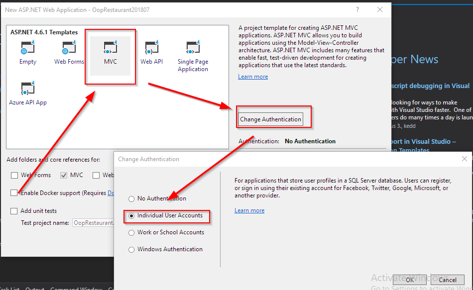
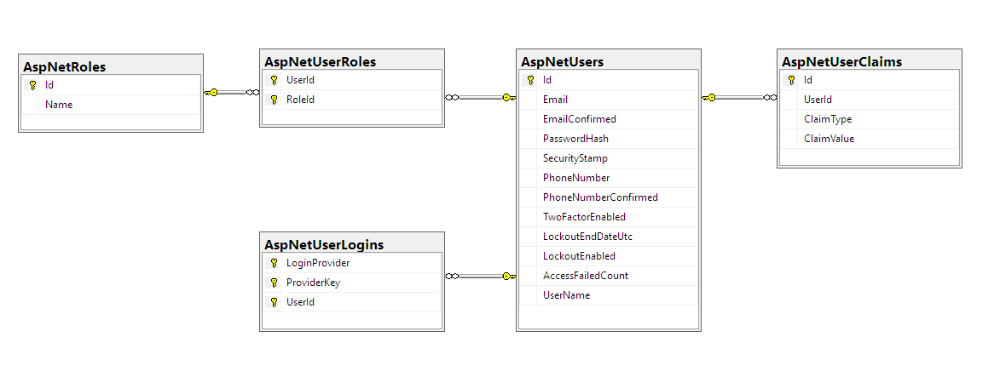

# OopRestaurant201807
A NetAcadémia "Betekintés az objektumorientált programozásba a weben is: az étterem projekt" tanfolyamának kódtára

## ASP.NET MVC és varázslói

## ASP.NET Identity

```
    Felhasználók                                             Webalkalmazás

+----------------------------+                            +-------------------------------------------+
|                            |                            |                                           |
|  +----------------------+  |                            |     Publikus oldalak                      |
|  | Ismeretlen           |  |                            |   +-----------------------+               |
|  | felhasználó          |  | +----------------------->  |   |                       |               |
|  | (nem azonosítottuk)  |  |                            |   |  Étlap megtekintése   |               |
|  |                      |  |                            |   |                       |               |
|  |                      |  |          ^-------------->  |   |                       |               |
|  |                      |  |          |                 |   |                       |               |
|  +----------------------+  |          |                 |   +-----------------------+               |
|                            |          |                 |                                           |
|                            |          |                 |                                           |
|                            |          |                 |                                           |
|                            |          |                 |     Nem publikus oldalak                  |
|  +---------------+------+  |          |                 |   +-----------------------+               |
|  | Azonosított   |      |  |          |                 |   |                       |               |
|  | felhasználó   |jogok |  |          |                 |   |  Étlap módosítása     |               |
|  | (átment az    |      |  | +--------> ha van joga     |   |                       |               |
|  | azonosításon) |      |  |          |                 |   |                       |               |
|  |               |      |  |          +-------------->  |   |                       |               |
|  +---------------+------+  |                            |   +-----------------------+               |
|                            |                            |                                           |
+----------------------------+                            |                                           |
                                                          |                                           |
                                                          +-------------------------------------------+
```
Ez egyáltalán nem triviális feladat: azonosítás és jogosultságkezelés

### Azonosítás
- név+jelszó
  - jelszó tárolása hash formában
  - jelszó bonyolultságának ellenőrzése
  - felhasználó regisztrációja
  - elfelejtett jelszó
  - jelszóváltoztatás
  - felhaszáló lockolása megadott számú rossz próbálkozás után
  - e-mail cím ellenőrzése egy ellenőrző e-mail-lel
  - két faktoros azonosítás
- külső bejelntkeztetési szolgáltatás használata
  - google
  - facebook
  - twitter
  - microsoft
  - linkedin

Az ASP.NEt Identity mindezt helyettünk megoldja.

### ASP.NET MVC alkalmazás létrehozása Identity-vel
C# projekt, ASP.NET Web Appplication (.NET Framework) kiválasztása után:




## Code First Migrations

```
 Adatbázis                               Alkalmazás
+------------------------+              +---------------------------+
|                        |              |                           |
| Text állomány          |   +------->  |  ami az adatokat          |
|  - csv                 |              |  használja                |
|  | xml                 |   <-------+  |                           |
|  - json                |              |                           |
| Komolyabb adatbázis    |              |                           |
| -sqlight               |              |                           |
| -sql szerver           |              |                           |
|                        |              |                           |
|                        |              |                           |
|                        |              |                           |
|                        |              |                           |
+------------------------+              +---------------------------+


      Telepítéskor: egyszerre kell kialakítani az adatbázist és az alkalmazást
      a célgépen

```

Az Identity nagyon csábító megoldást mutat: elindítom az alkamazást, és nem kell semmilyen telepítő, ő a háttérben létrehozza a saját adatbázisát.

### 1. Feladat
valahogy elérni, hogy ne automatikusan hozza létre az adatbázist, hanem legyen rá hatásunk.
- [X] mikor hozza létre?
- [X] hova hozza létre?
- [X] meg tudjuk-e adni az adatbázis helyét?
- [ ] saját adatokat is el lehet benne helyezni?


```
                          Entity Framework
 Adatbázis                Code First     Alkalmazás
+------------------------+Migrations    +---------------------------+
|                        |              |                           |
| -MS SQL Szerver        |      +       |  ami az adatokat          |
|                        |      |       |  használja                |
|                        |      v       |                           |
|                        |              |                           |
|                        |  <--------+  |  Adatmodell módosítás     |
|                        |              |                           |
|                        |  <--------+  |  Adatmodell módosítás     |
|                        |              |                           |
|                        |  <--------+  |  Adatmodell módosítás     |
|                        |              |                           |
|                        |  <--------+  |  Adatmodell módosítás     |
+------------------------+              +---------------------------+

      Telepítéskor:   Az alkalmazás hozza létre az adatbázist magának
```

#### A Code First Migrations beüzemelése
- előfeltétel: az [EntityFramework Nuget csomag](https://www.nuget.org/packages/EntityFramework/) megléte (Az ASP.NET MVC Identity telepítette, ezért ez megvan)
- engedélyezés
  ```
    PM> enable-migrations
    Checking if the context targets an existing database...
    Code First Migrations enabled for project OopRestaurant201807.
  ```

  ez létrehozta a **Migrations\Configuration.cs** állomámnyt.

- az Identity modelljének kiírása egy **migration step**-be
  ```
    PM> add-migration 'Identity datamodel'
    Scaffolding migration 'Identity datamodel'.
    The Designer Code for this migration file includes a snapshot of your current Code First model. This snapshot is used to calculate the changes to your model when you scaffold the next migration. If you make additional changes to your model that you want to include in this migration, then you can re-scaffold it by running 'Add-Migration Identity datamodel' again.
  ```
  a lépés megnevezése tetszőleges, én úgy hívtam, hogy *'Identity datamodel'*, hogy be tudjam azonosítani később ezt a lépést.

  ez létrehozta a **Migrations\201807050914249_Identity datamodel.cs** állományt (meg még két technikai állományt)

  ezt hívjuk: egy db módosító lépés, migration step. Két fontos része van: az **Up()** és a **Down()** függvények. 
  - Az Up() fügvény akkor kell, ha a módosítást bejátsszuk az adatbázisba, 
  - a Down() pedig akkor dolgozik, ha visszavonjuk ezt a módosítást.

- A Migration step kiírása adatbázisba
  ```
    PM> update-database
    Specify the '-Verbose' flag to view the SQL statements being applied to the target database.
    Applying explicit migrations: [201807050914249_Identity datamodel].
    Applying explicit migration: 201807050914249_Identity datamodel.
  ```

Első körben nem fut le, ennek oka, hogy a **web.config**-ban meg van adva az adatelérési út, amit keres. Ezt az mdf állományt már töröltem, így nincs ilyen ezért hibával elszáll.
Ha töröljük a **web.config**-ból az adatkapcsolati beállítást, akkor gond nélkül lefut.
 
ezt az adatbázist hozza létre:



Az adatbázis a saját gépen a **Default SQL Instance**-ra kerül, a neve pedig **DefaultConnection**.

#### Saját adatbázis megadása
Készítünk egy kapcsolati beállítást a [https://www.connectionstrings.com/](https://www.connectionstrings.com/) segítségével.

```xml
<connectionStrings>
    <add name="DefaultConnection" connectionString="Server=.\SQLEXPRESS;Database=OopRestaurantDb;Trusted_Connection=True"
         providerName="System.Data.SqlClient" />
</connectionStrings>
```

Fontos, hogy megadjuk a szerver nevét, az adatbázis nevét, és a módszert, ahogy a felhasználó bejelentkezik.

```
PM> update-database
Specify the '-Verbose' flag to view the SQL statements being applied to the target database.
Applying explicit migrations: [201807050914249_Identity datamodel].
Applying explicit migration: 201807050914249_Identity datamodel.
Running Seed method.
```

Ha újra futtatjuk az update-database-t, akkor ezt írja:

```
PM> update-database
Specify the '-Verbose' flag to view the SQL statements being applied to the target database.
No pending explicit migrations.
Running Seed method.
```

tehát, az eszközünk ismeri a modell verzióját, az adatbázis verzióját, és tudja, hogy nem hiányzik semmi.

Ezt a __MigrationHistory tábla segítségével tudja.

A Migrations könyvtárban lévő állománynevek tartalmazzák az adatbázis módosító lépéseket, amik a kódban vannak.
A __MigrationHistory tábla tartalmazza azokat a lépéseket, amik az adatbázisban vannak.

#### Visszavonni az egyes lépéseket
az összes visszavonása (visszaállás a 0. verzióra)

```
PM> update-database -t 0
Specify the '-Verbose' flag to view the SQL statements being applied to the target database.
Reverting migrations: [201807050914249_Identity datamodel].
Reverting explicit migration: 201807050914249_Identity datamodel.
PM> 
```

A **-t** a TargetMigration paraméter rövidítése, a 0 pedig a minden lépés előtti állapot

#### Mit csinálnak az egyes lépések?
```
PM> update-database -Script
Applying explicit migrations: [201807050914249_Identity datamodel].
Applying explicit migration: 201807050914249_Identity datamodel.
```

A -Script paraméterrel nem fut le a módosítás, viszont megmutatja nekünk azt az SQL scriptet, amit a migration step-ből generál.

```
 A kódban lévő módosító lépések                                    Az adatbázisban lévő módosító lépések

+-------------------------------------+                           +---------------------------------+
|                                     |                           |                                 |
|                                     |   A hiányzó lépések       |                                 |
|  A \Migrations mappa alatt lévő     |   kerülnek az adatbázisba |                                 |
|  egyes lépések állományai           |                           |  A __MigrationHistory táblában  |
|                                     |                           |  lévő sorok                     |
|                                     |    update-database        |                                 |
|                                     |                           |                                 |
|                                     |  +--------------------->  |                                 |
|                                     |                           |                                 |
|                                     |  Ez a migration step-ben  |                                 |
|                                     |  lévő köztes nyelvből     |                                 |
|                                     |  az adatbázisnak megfelelő|                                 |
|                                     |  SQL scriptet gyárt, majd |                                 |
|                                     |  lefuttatja az SQL        |                                 |
|                                     |  szerveren                |                                 |
|                                     |                           |                                 |
|                                     |                           |                                 |
|                                     |                           |                                 |
|                                     |                           |                                 |
|    ^                                |                           |                                 |
|    |                                |                           |                                 |
+-------------------------------------+                           +---------------------------------+
     |
     |
     +

   A modell módosítása után,
   az add-migration paranccal készülnek
   a módosító lépések
```